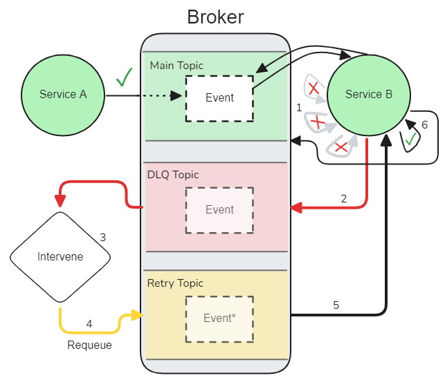

<!--
 Copyright 2021 - 2026 Universität Tübingen, DKFZ, EMBL, and Universität zu Köln
 for the German Human Genome-Phenome Archive (GHGA)

 Licensed under the Apache License, Version 2.0 (the "License");
 you may not use this file except in compliance with the License.
 You may obtain a copy of the License at

     http://www.apache.org/licenses/LICENSE-2.0

 Unless required by applicable law or agreed to in writing, software
 distributed under the License is distributed on an "AS IS" BASIS,
 WITHOUT WARRANTIES OR CONDITIONS OF ANY KIND, either express or implied.
 See the License for the specific language governing permissions and
 limitations under the License.
-->

# Dead Letter Queue (DLQ)

## Overview
This document describes the Dead Letter Queue (DLQ) mechanism in hexkit, which provides robust error handling for event processing failures in Kafka-based event systems. The DLQ support allows services to gracefully handle failed event processing by redirecting problematic events to a dedicated queue for later analysis or reprocessing, rather than crashing the service.

For information about general event subscription, see [Event Driven Architecture](./event_driven_arch.md).

## DLQ Lifecycle

Apache Kafka doesn't provide out-of-the-box DLQ functionality, so hexkit bridges that gap. The Kafka event subscriber provider in hexkit can be configured to automatically handle a DLQ event flow with only minor changes in the standard usage. When an event consumer encounters an exception while processing an event, the system can:

1. Retry the event processing (if configured)
2. When retries are exhausted, publish the failed event to a dedicated DLQ topic
3. Continue processing other events instead of crashing



The flow diagram above demonstrates the general DLQ lifecycle:

1. Failed events are retried a configurable number of times.
2. Upon final failure, they are published to the configured DLQ topic.
3. Events in the DLQ are manually reviewed through an external solution.
4. DLQ events are eventually retried by publishing them to a service-specific `retry-*` topic.
5. Upon consuming an event from the retry topic, the consumer restores the original
topic name and proceeds with the normal request flow.
6. The event is consumed again, this time successfully.
   - If the event fails again for some reason, the DLQ process restarts.


## DLQ Event Structure

When an event is published to the DLQ, it maintains the original payload, type, and key, but includes additional headers with information about the failure:

| Header         | Description                                             |
| -------------- | ------------------------------------------------------- |
| event_id       | UUID4 unique to the event instance                      |
| service        | The name of the microservice where failure occurred     |
| original_topic | The topic where the event was originally published      |
| exc_class      | The class name of the exception that caused the failure |
| exc_msg        | The error message from the exception                    |

#### Example DLQ Event

Assumes the following event is consumed from a `users` topic and results in an error:
```json
{
  "payload": {"user_id": "abc123"},
  "key": "abc123",
  "headers": {
    "type_": "user_registered",
    "correlation_id": "a648c68c-f14b-4d0a-8fc8-31824987613c",
    "event_id": "290de3f3-1a99-4c61-b71a-4074b65a4918",
  }
}
```

That event then becomes the following when published to the DLQ topic:
```json
{
  "payload": <original event payload>,
  "key": <original event key>,
  "headers": {
    "type_": <original event type>,
    "correlation_id": <original correlation ID>,
    "event_id": <original event ID>,
    "service": "my-service",
    "original_topic": "users",
    "exc_class": "ValueError",
    "exc_msg": "Invalid data format"
  }
}
```

You can see that the DLQ event contains extra header information that can be used to
deal with the event later.

## Consuming From the DLQ

While hexkit makes it easy to both divert problematic events to a DLQ topic and reintroduce them once resolved, it does not provide a comprehensive toolbox for DLQ event resolution. The user is entirely responsible for monitoring and maintaining the DLQ topic and its events, although hexkit does provide some facilitating classes. GHGA, for example, uses a dedicated DLQ Service.
For consuming events from the DLQ, hexkit provides the `DLQSubscriberProtocol`. This protocol extends the standard EventSubscriberProtocol with additional parameters for accessing the DLQ metadata.


## Republishing and Re-consuming DLQ Events

Events that are dealt with in the DLQ topic and destined to be republished should receive a fresh `event_id` to mark them as distinct from the original. Furthermore, events should not be republished to their original topic. Instead, they should be republished to a special retry topic with a name in the format `retry-<service_name>`. The service name should match the value configured for `KafkaConfig.service_name` and thus the value included in the DLQ supplementary header, `service`. For instance, if the service name is `abc`, then the reviewed event should be republished to a topic called `retry-abc`. The `abc` service will consume this event and the `KafkaEventSubscriber` class from hexkit will automatically substitute `retry-abc` with the the value for `original_topic` before passing the event to the service's event subscriber translator. The result is that the reintroduction procedure is completely transparent to the service's event subscriber translator, and the event gets processed identically to every other event.

Checklist:
- Generate a new UUID4 for the `event_id` header
- Preserve the `original_topic` header
- Do not include the `service`, `exc_msg`, or `exc_class` headers
- Republish the event to `retry-<service_name>`

## Configuration Parameters

The DLQ functionality is controlled by several configuration parameters in the KafkaConfig class:

| Parameter             | Description                                                    | Default | Example  |
| --------------------- | -------------------------------------------------------------- | ------- | -------- |
| `kafka_max_retries`   | Maximum number of times to retry failed events                 | 0       | 3        |
| `kafka_enable_dlq`    | Toggle to enable/disable DLQ functionality                     | False   | True     |
| `kafka_dlq_topic`     | Topic name for the Dead Letter Queue                           | "dlq"   | "my-dlq" |
| `kafka_retry_backoff` | Base seconds to wait before retrying (doubles with each retry) | 0       | 2        |

#### Minimal Example Configuration:

```python
config = KafkaConfig(
    service_name="my-service",
    service_instance_id="instance-1",
    kafka_servers=["kafka:9092"],
    kafka_max_retries=3,
    kafka_enable_dlq=True,
    kafka_dlq_topic="dlq",
    kafka_retry_backoff=2
)
```

## Retry Mechanism

The retry mechanism operates alongside and independently of the DLQ feature, but the two are intended to be used in concert. The DLQ filters events that would otherwise cause a service to crash, but oftentimes those failures are due to transient issues like database connection interruptions. The retry mechanism can help prevent clogging the DLQ with transient failures that don't represent genuine errors. The basic retry logic is straightforward:

1. If retries are enabled (`kafka_max_retries` > 0), the event is retried immediately
2. Each retry attempt uses exponential backoff based on the `kafka_retry_backoff` setting
3. The backoff time doubles with each retry attempt: `backoff_time = retry_backoff * 2^(retry_number - 1)`
4. If retries are exhausted and an error still occurs, the behavior depends on whether the DLQ is enabled. If the DLQ is enabled, the error bubbles up to the level of the hexkit provider, which publishes the event to the DLQ along with the error information. If the DLQ is not enabled, the error is re-raised as a `RetriesExhaustedError`. If this error is unhandled at the service level, the service will crash. In order to handle `RetriesExhaustedError` instances, the `try/except` must be placed around the `.run()` call on the subscriber.
