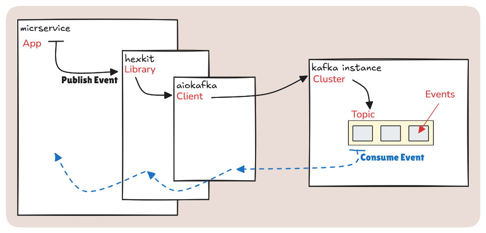

<!--
 Copyright 2021 - 2026 Universität Tübingen, DKFZ, EMBL, and Universität zu Köln
 for the German Human Genome-Phenome Archive (GHGA)

 Licensed under the Apache License, Version 2.0 (the "License");
 you may not use this file except in compliance with the License.
 You may obtain a copy of the License at

     http://www.apache.org/licenses/LICENSE-2.0

 Unless required by applicable law or agreed to in writing, software
 distributed under the License is distributed on an "AS IS" BASIS,
 WITHOUT WARRANTIES OR CONDITIONS OF ANY KIND, either express or implied.
 See the License for the specific language governing permissions and
 limitations under the License.
-->

# Event-Driven Architecture

This document provides an overview of the asynchronous communication methods between microservices. It offers both a high-level explanation of how information is sent and received and an examination of the layers of abstraction implemented within Hexkit. The document also outlines how the outbox pattern is employed to solve certain challenges.

In the following, we assume that Apache Kafka is used as the event streaming infrastructure, since this is the primary and currently only infrastructure that Hexkit supports. However, the idea behind Hexkit is that it could be extended to also support other event streaming infrastructure such as Apache Pulsar or, in principle, message brokers or event bus services.

## Event-driven Architecture with Apache Kafka

> See the [Kafka documentation](https://kafka.apache.org/intro) for in-depth information on Kafka's inner workings.

Event-driven architecture refers to a protocol where information is exchanged indirectly and often asynchronously by interacting with a broker. Rather than making direct API calls from one service to another, one service, called the *producer*, publishes information to a broker in the form of an *event* (also called a *message*), and is ignorant of all downstream processing of the event. It is essentially "fire and forget". Other services, called *consumers*, can consume the event once it has been published. The same way the producer is ignorant of an event's fate, the consumers are ignorant of its origin. This has important implications for design. In Kafka, events have metadata headers, a timestamp, a *key*, and a *payload*. Hexkit adds a *type* field in the metadata headers to further distinguish events. Events are organized into configurable *topics*, and further organized within each topic by key. A topic can have any number of producers and consumers, and messages are not deleted after consumption (enabling rereads).

In the context of microservices, event-driven architecture provides some important benefits:

1. **Decoupling of Service Dependencies:** Services communicate by emitting events, rather than direct requests, reducing service coupling. Keeping contractual definitions (i.e. payload schemas) in a dedicated library means services can evolve with minimal change propagation.
2. **Asynchronous Communication:** Kafka facilitates asynchronous data processing, allowing services to operate independently without waiting for responses. This improves performance and fault tolerance, as services can continue functioning even if one component is slow or temporarily unavailable.
3. **Consistency and Order Guarantee:** Kafka maintains the order of events within a partition for a given key, crucial for consistency in processing events that are related or dependent upon one another.

But event-driven architecture also introduces challenges:

1. **Duplicate processing:** Because the event consumers have no way to know whether an event is a duplicate or a genuinely distinct event with the same payload, the consumers must be designed to be idempotent.
2. **Data Duplication:** If service A needs to access the data maintained by service B, the options are essentially an API call (which introduces security, performance and coupling concerns) or duplicating the data of service B for service A. Hexkit supports mitigating this issue via data duplication by way of the outbox pattern, described later in this document.
3. **Tracing:** A single request flow can span many services with a multitude of messages being generated along the way. The agnostic nature of producers and consumers makes it harder to tag requests than with traditional API calls, and several consumers can process a given message in parallel, sometimes leading to complex request flows. Hexkit enables basic tracing by generating and propagating a *correlation ID* (also called a request ID) as an event header.

## Abstraction Layers

Hexkit features protocols and providers to simplify using
Kafka in services. Instead of writing the functionality from scratch in every new
project, Hexkit provides the `KafkaEventPublisher` and `KafkaEventSubscriber`
provider classes, in addition to an accompanying `KafkaConfig` Pydantic config class.

### Producers

When a service publishes an event, it uses the `KafkaEventPublisher` provider class along with a service-defined _translator_ (a class implementing the `EventPublisherProtocol`). The purpose of the translator is to provide a domain-bound API to the core of the service for publishing an event without exposing any of the specific provider-related details. The core calls a method like `publish_user_created()` on the translator, and the translator provides the requisite payload, topic, type, and key to the `KafkaEventPublisher`. The translator's module usually features a config class for defining the topics and event types used. It's important to note that a translator is not strictly required in order to use the `KafkaEventPublisher`. As long as the required configuration is provided, there's nothing to stop the core from using it directly. However, it will make switching to a different infrastructure (that might be supported by Hexkit in the future) more difficult.

### Consumers

While the `KafkaEventPublisher` can be used directly, the `KafkaEventSubscriber` always requires a *translator* to deliver event payloads to the service's core components. The translator is defined outside of Hexkit (i.e. in the service code) and implements the `EventSubscriberProtocol`. The provider hands off the event to the translator through the protocol's `consume` method, which in turn calls an abstract method implemented by the translator. The translator receives the event and examines its attributes (the topic, payload, key, headers, etc.) to determine processing. Naturally, the actual processing logic varies, but usually the payload is validated against the expected schema and used to call a method in the service's core. When control is returned to the `KafkaEventSubscriber`, the underlying consumer (from `AIOKafka`) saves its offsets, declaring that it has successfully handled the event and is ready for the next.

A diagram illustrating the process of event publishing and consuming, starting with
the microservice:

## Outbox Pattern

Sometimes services need to access data owned by another service. The challenge of enabling this kind of linkage involves ensuring data consistency and avoiding coupling. The outbox pattern provides a way to mitigate these risks by publishing persisted data as Kafka events for other services to consume as needed. Some advantages include:

- Events can be republished from the database as needed (fault tolerance)
- The coupling between services is minimized
- The data producer remains the single source of truth
- Kafka events no longer need to be backed up separately from the database

### Topic Compaction & Idempotence

Topic compaction means retaining only the latest event per key in a topic. Why do this? In Hexkit's implementation of the outbox pattern, published events are categorized as one of two event types: `upserted` or `deleted`. The entire state of the object, insofar as it is exposed by the producer, is represented in every event. Consumers interpret the event type and act accordingly, based on their needs (although this typically translates to at least upserting or deleting the event in their own database). When combined with topic compaction, the result is that consumers only have to get the latest event to be up to date with the originating service.

### Implications

One requirement of using the outbox pattern as implemented in Hexkit is that consumers must be idempotent. The state of Kafka is stored in the database and can be republished as needed, so services must be prepared to consume the same event more than once. Event republishing might need to occur at any time, so it is possible for sequence-dependent events to be re-consumed out of sequence. Depending on the complexity of the microservice landscape, it can be difficult to foresee all the potential cases where out-of-order events could be problematic. That's why it's paramount to perform robust testing and use features like topic compaction where necessary.

## Tracing

Request flows are traced with a `correlation ID`, or request ID, which is generated at the request origin. The correlation ID is propagated through subsequent services by adding it to the metadata headers of Kafka events. When a service consumes an event, the provider automatically extracts the correlation ID and sets it as a [context variable](https://docs.python.org/3.9/library/contextvars.html#context-variables) before calling the translator's `consume()` method. In the case of the outbox mechanism, the correlation ID is stored in the document metadata. When initial publishing occurs, the correlation ID is already set in the context. For republishing, however, the correlation ID is extracted and set before publishing the event, thereby maintaining traceability for disjointed request flows.
