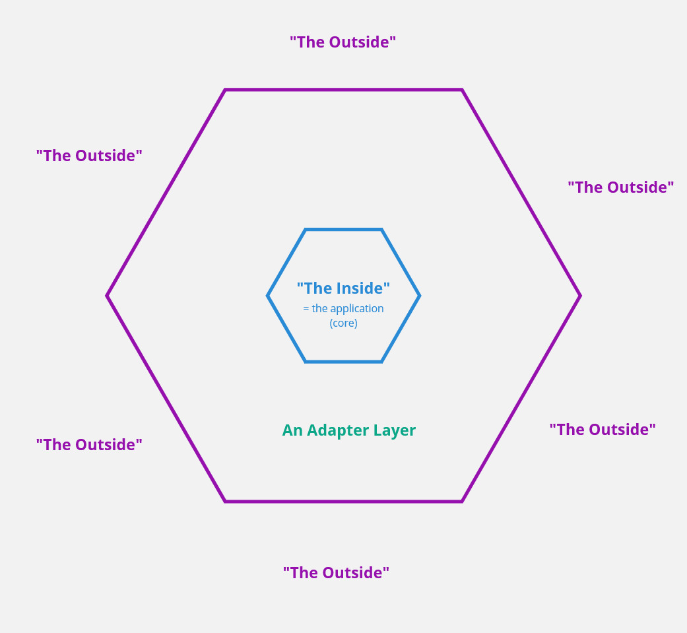
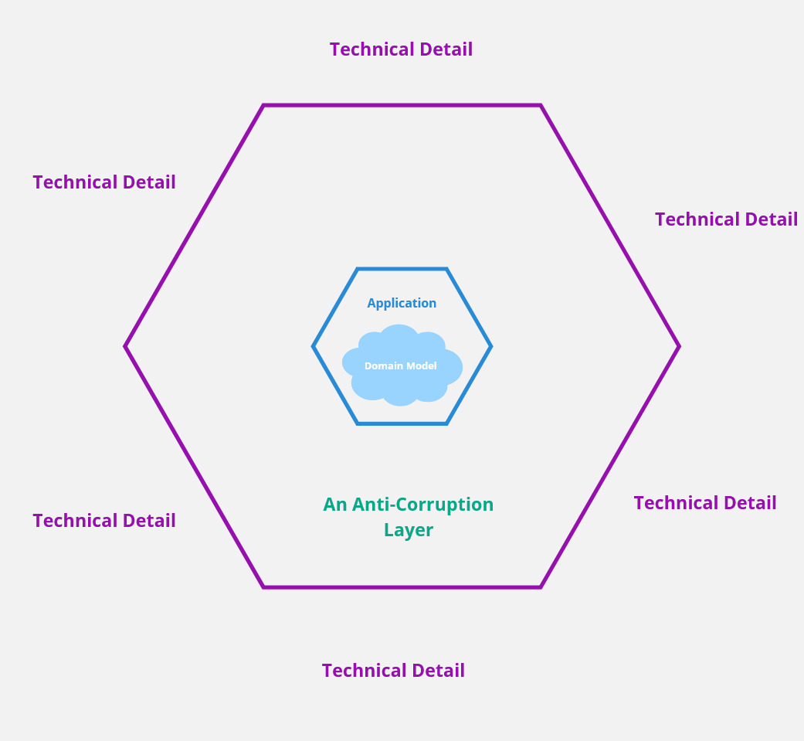
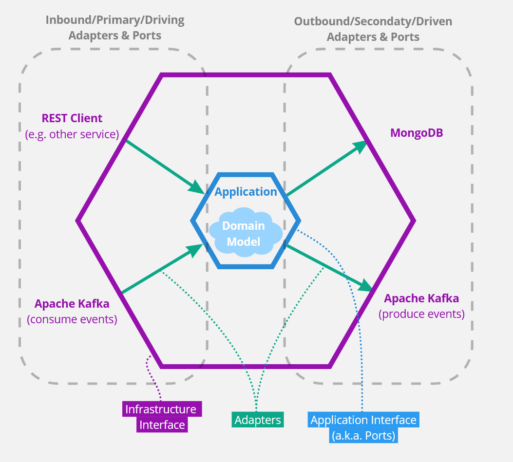

<!--
 Copyright 2021 - 2026 Universität Tübingen, DKFZ, EMBL, and Universität zu Köln
 for the German Human Genome-Phenome Archive (GHGA)

 Licensed under the Apache License, Version 2.0 (the "License");
 you may not use this file except in compliance with the License.
 You may obtain a copy of the License at

     http://www.apache.org/licenses/LICENSE-2.0

 Unless required by applicable law or agreed to in writing, software
 distributed under the License is distributed on an "AS IS" BASIS,
 WITHOUT WARRANTIES OR CONDITIONS OF ANY KIND, either express or implied.
 See the License for the specific language governing permissions and
 limitations under the License.
-->

# Hexagonal Architecture

## Introduction

Hexagonal Architecture, also known as the "Ports and Adapters" pattern, is a software architecture pattern originally described by Alistair Cockburn in 2005. It aims to create loosely coupled application components that can be easily connected to their software environment through ports and adapters, while maintaining a clean separation between purely technical concerns and the core business logic.

The pattern addresses fundamental challenges that became apparent when developers started following Domain-Driven Design (DDD) principles: how to keep the domain model pure and isolated from infrastructure concerns while maintaining testability and flexibility.

## The Core Concept

The fundamental idea behind Hexagonal Architecture is to isolate the core business logic of an application from external concerns such as databases, user interfaces, web frameworks, and other external systems. This separation prevents technical concerns from bleeding into the domain logic through the introduction of an adapter layer.

### The Hexagonal Shape

The architecture is called "hexagonal" because it's often depicted as a hexagon with the application core at the center, surrounded by ports and adapters. However, the exact shape doesn't matter—it could be any polygon or even a circle. The key principle is the clear separation between "the inside" (application core) and "the outside" (external systems) using an adapter layer.

### Clean Architecture

A similar software design was formalized by Robert C. Martin in 2012 under the name "Clean Architecture". It uses different terminology but emphasizes the same separation of concerns.

## Relationship to Domain-Driven Design

Hexagonal Architecture nicely complements Domain-Driven Design (DDD) by introducing an "anti-corruption layer" between the application layer and technical infrastructure. The core idea of DDD was to focus on the domain model and keep it pure, isolated from infrastructure concerns.

This architectural approach allows major architectural decisions to be deferred, as the domain logic remains decoupled from specific technical implementations.

## Architecture Components

### Application Core ("The Inside")

The center of the hexagon contains the business logic and domain models. This core:

- Contains no references to external frameworks or technologies.
- Uses only domain language and concepts.
- Defines ports (interfaces) for external interactions.
- Implements the core business rules and logic.
- Remains focused on solving the specific domain/business problem.

### Ports

Ports are interfaces that define the contract between the application core and the external world. They serve as the interaction points with the outside world using domain-specific language. Ports come in two types:

#### Inbound Ports (Primary/Driving Ports)

These are interfaces that allow external actors to interact with the application. They represent ways the outside world can "drive" the application by putting it out of an idle state and giving it tasks to work on.

#### Outbound Ports (Secondary/Driven Ports)

These are interfaces that the application uses to interact with external systems. They are "driven" by the application when it needs to perform operations outside its core domain.

### Adapters

Adapters are concrete implementations of the ports that handle the translation between the domain language and the specific technology being used. They exist outside the core application codebase and connect the application ports with external infrastructure.

#### Inbound Adapters (Primary/Driving Adapters)

These adapt external requests to the application's inbound ports.

#### Outbound Adapters (Secondary/Driven Adapters)

These implement the outbound ports and handle communication with external systems.

### Examples of Ports and Adapters

**Inbound (Primary/Driving) Examples:**

- **Port**: User interface abstraction for handling user commands.
- **Adapter**: REST API controller that translates HTTP requests to domain operations.
- **Port**: Event processing interface for handling external events.
- **Adapter**: Apache Kafka consumer that processes messages from a topic.
- **Port**: Command-line interface for batch operations.
- **Adapter**: CLI handler that processes command-line arguments and options.

**Outbound (Secondary/Driven) Examples:**

- **Port**: Repository interface for data persistence using domain language.
- **Adapter**: PostgreSQL or MongoDB DAO implementation.
- **Port**: External service integration interface.
- **Adapter**: HTTP client for communicating with external APIs.
- **Port**: Event publishing interface for domain events.
- **Adapter**: Message queue publisher for Apache Kafka or RabbitMQ.

The following diagram illustrates how these components interact, showing the application core at the center with various ports and adapters connecting it to external systems and actors.

## Benefits of Hexagonal Architecture

Let's summarize the main benefits of this architecture again:

### Domain Focus

Development can primarily focus on the logic needed to solve the domain problem, which is the actual motivation for the software project. The domain logic can be worked on in isolation from infrastructural details.

### Testability

The separation of concerns makes it easy to test the business logic in isolation using true unit tests. Mock implementations of outbound ports can be provided for testing, while inbound adapters are not relevant for unit testing. This:

- Improves testing quality by cleanly separating unit from integration tests.
- Significantly increases test execution speed.
- Enables effective test-driven development.

### Flexibility and Technology Independence

Different adapters can be plugged in without changing the core business logic. The application becomes less coupled to specific environments or infrastructural setups. For example:

- Switch from REST API to GraphQL API.
- Change from MongoDB to PostgreSQL.
- Replace message brokers without touching core logic.

### Maintainability

The application core becomes easier to understand, which simplifies maintenance and helps onboard new developers. Domain complexity is not further inflated by technological complexity.

### Infrastructural Agnosticism

Changes to infrastructure requirements often only affect the thin adapter layer, not the complex domain logic. This is particularly valuable for open-source projects, as it increases software reach by allowing easy integration into different infrastructure stacks.

### Evolutionary Architecture

The pattern supports architectural evolution over time, allowing teams to explore different technical options in parallel or postpone technology decisions until more information is available.

## References

- [Original proposal of the hexagonal architecture by Alistair Cockburn](https://alistair.cockburn.us/hexagonal-architecture/)
- [Introduction to the hexagonal architecture based on code examples](https://www.youtube.com/watch?v=22WUhddwkS8)
- [Presentation about "Clean Architecture" by Robert C. Martin](https://www.youtube.com/watch?v=Nsjsiz2A9mg)
- [Domain-Driven Design: Tackling Complexity in the Heart of Software by Eric Evans](https://www.youtube.com/watch?v=dnUFEg68ESM)
