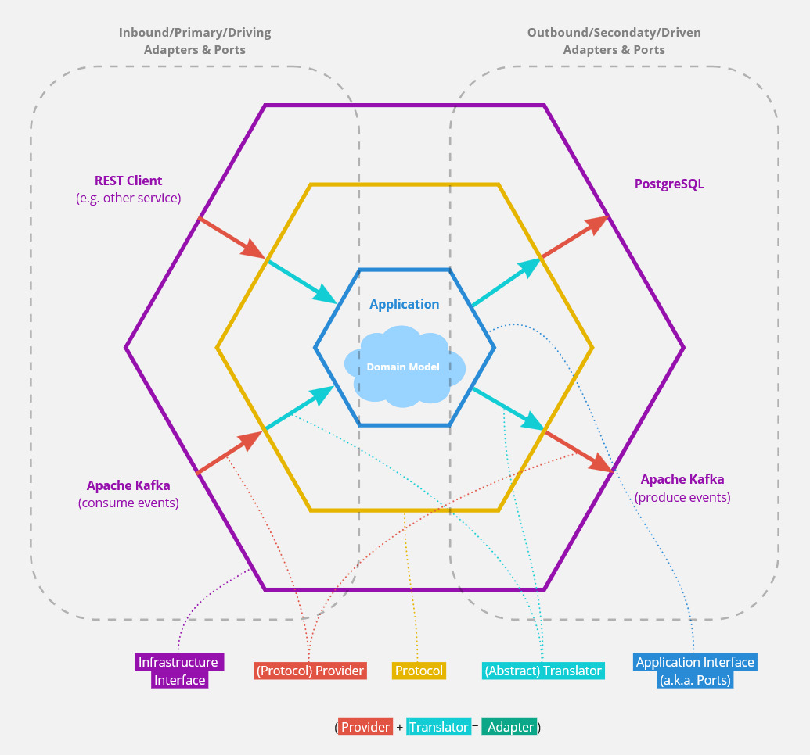
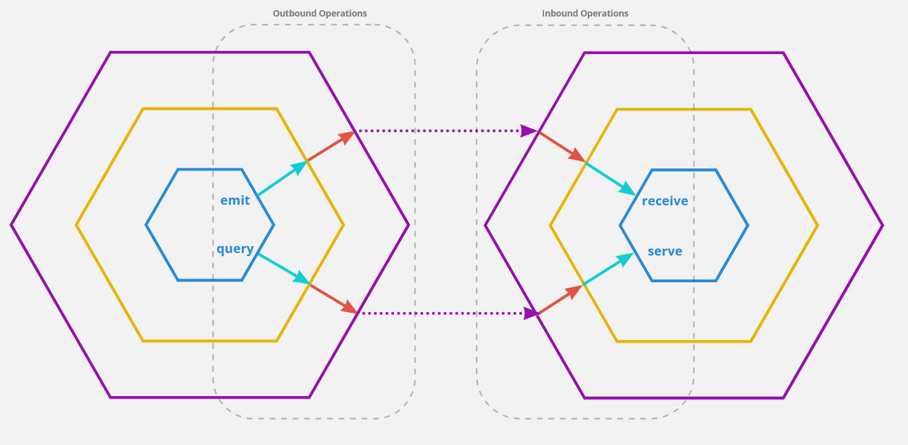
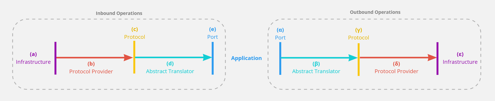

<!--
 Copyright 2021 - 2026 Universität Tübingen, DKFZ, EMBL, and Universität zu Köln
 for the German Human Genome-Phenome Archive (GHGA)

 Licensed under the Apache License, Version 2.0 (the "License");
 you may not use this file except in compliance with the License.
 You may obtain a copy of the License at

     http://www.apache.org/licenses/LICENSE-2.0

 Unless required by applicable law or agreed to in writing, software
 distributed under the License is distributed on an "AS IS" BASIS,
 WITHOUT WARRANTIES OR CONDITIONS OF ANY KIND, either express or implied.
 See the License for the specific language governing permissions and
 limitations under the License.
-->

# Triple Hexagonal Architecture

## Introduction

Triple Hexagonal Architecture, the design pattern embodied by Hexkit, is an extension of Hexagonal Architecture. If you are not already familiar with Hexagonal Architecture, please read the [Hexagonal Architecture](hexagonal_arch.md) chapter first.

## The Motivation

The Hexagonal Architecture design pattern provides a clean separation between an application's core (i.e., the business logic or domain logic) and its outside dependencies such as databases, event/message brokers, or client delivery mechanisms (REST, RPC, WebSocket, etc.). As such, the pattern is principally applicable to both monoliths and microservices. However, a common issue in microservice settings is high code redundancy or code replication across microservice repositories. While this code redundancy is a general issue of microservices and not specific to Hexagonal Architecture, the design pattern on its own provides no solution to it. Fortunately, however, the redundancy in hexagonally designed microservices is highly concentrated in the adapter code, which is not specific to the domain use case(s) of a microservice but largely consists of cross-cutting logic to interface with external infrastructure. Here we present an extension to the Hexagonal Architecture design pattern that addresses the code redundancy by providing a systematic approach for separating service-specific from service-independent adapter logic.

## The Core Concept

In the traditional Hexagonal Architecture, an adapter mediates between the application interface (a.k.a. "ports"), which is written in the language of the domain, and the infrastructure interface, which uses technology-specific jargon:

In the proposed extension, a third interface referred to as a protocol is added that splits the adapter into two parts as depicted in this diagram:

A protocol describes an abstract concept of a type of infrastructure without exposing all the details of a specific implementation of that infrastructure. The only function of the inner part of an adapter is to translate between a port (of the application interface) and the protocol. Since both of these interfaces (port and protocol) are abstract and not bound to a specific type of infrastructure, we refer to this part of the adapter as the "abstract translator" or simply "translator". The second (outer) part of the adapter provides an implementation of the protocol that is infrastructure-specific. This second adapter part is referred to as a "protocol provider" or simply "provider".

Since the protocol interface is depicted as a third, additional hexagon, we propose "Triple Hexagonal Architecture" as the name for this design pattern.

## The Protocol Definition Matters

The protocol is the key ingredient of the Triple Hexagonal Architecture as it defines the separation between the two adapter fragments (protocol provider and abstract translator). Therefore, it is important to understand the intentions behind the protocol:

The aim of a protocol definition is not necessarily to find an abstraction that most accurately reflects the underlying concept or mechanism of a specific type of infrastructure (such as event brokers). The primary aim of the protocol definition is to provide a pragmatic separation between, on the one hand, adapter logic that is service- or codebase-specific (i.e., the abstract translator), and, on the other hand, general-purpose adapter logic that can be shared across services or codebases (i.e., the protocol provider).

## The Perspective of the Application Interface

Generally, the ports that together define the application interface should only use domain language and should avoid assumptions about the nature of the surrounding infrastructure. To more concretely outline what this means, we propose the following terms that may be used to classify and describe ports and associated operations:

### Emit

An emit operation or emission is an outbound operation that publishes data to the outside world in a "fire-and-forget" fashion. From the perspective of the emitter, it remains unclear who is consuming that data and whether the data is correctly processed on the receiving side.

### Receive

A receive operation is inbound and consumes data from an emitter without sending a response. An inbound receive operation in one application (receiver) corresponds to an outbound emit operation produced by another application (emitter). A natural fit for implementing emitter and receiver adapters is the use of event brokers such as Apache Kafka. However, in principle, the interaction could also be realized via protocols such as HTTP.

### Query

A query operation is outbound; however, unlike emit operations, a response is mandatory. The response can contain an extensive payload or it could be a simple "OK". In both cases, the response should not only indicate that the data sent by the querier was received but also that it was successfully processed by the consumer.

### Serve

A serve operation performed by one application (servant) is the inbound counterpart of a query operation performed by another application (querier). This interaction represents a point-to-point contact between the servant and the querier. A serve operation must always send back a response even if the response only confirms the successful processing of the received data. Moreover, multiple query-serve interactions may or may not happen as part of a transactional scope. A natural fit for implementing non-transactional serve and query adapters is the use of REST or gRPC. Database queries are an example that could be modeled as transactional query-serve relationships between an application and its database server.

We recommend that a port should only be classified using one of the above terms and it should not make additional assumptions about the technical nature of the interaction and specifically the data transmission mechanism. This recommendation should outline the difference in intent between protocols and ports.

A schematic representation of operation types from the perspective of the application - the perspective used to define the application interface (a.k.a. "ports"):

## Operation Examples

To further illustrate the Triple Hexagonal Architecture concept, below, we have listed examples for inbound and outbound operations. The examples are centered around protocols that correspond to infrastructure types that are commonly used in a microservice setting.

The steps involved in the following examples correspond to this visual legend:

### Consuming Events from a Broker

**Receive** operation:

(a) Apache Kafka may serve as an event broker. (Potential alternatives: AWS Kinesis, or even RabbitMQ)

(b) A protocol provider specific for consuming events from Apache Kafka may be used. Internally, it handles the communication with the broker, e.g., by using the kafka-python client library. (There may be alternative providers, e.g., for AWS Kinesis or RabbitMQ that may serve as a drop-in replacement. Moreover, mock or in-memory providers might be used for testing.)

(c) This protocol describes the abstract concept of consuming an event from an event broker. It is aware of the following notions: event type (the type of event, e.g., "user_account_upserted" or "user_account_deleted"), event key (all events with the same key are guaranteed to be delivered in order), event payload (the actual content/data that is shipped with the event), event schema (the shape of the payload which is defined by the event type), and topics (high-level organization of events into logs). Technical details on the underlying implementation are not specified by the protocol. How this vocabulary is used may vary considerably between protocol providers. Moreover, providers may choose to ignore some of the vocabularies if it is not relevant for the corresponding technology (e.g., a RabbitMQ provider might ignore the "event key" term since AMQP has no concept compatible with the notion of an event key).

(d) The abstract translator is able to translate the vocabulary used by the protocol into domain language used by the port. Thus, it knows how to convert the schema of an incoming event with a specific type (e.g., "user_account_upserted") into a domain representation (e.g., a domain entity object according to Eric Evans' DDD).

(e) The port is not aware of how events are organized into topics or how the payload was formatted. It might not even know (or need to know) that the data was passed in as an event. From the perspective of the port, this operation is simply seen as a *receive operation* (as defined above) with no further understanding of the involved delivery mechanism or technology. Data is expected not as JSON schema but as domain objects.

### Publishing Events to a Broker

**Emit** operation:

(α) Similar to the above example, the port involved in event publishing is not aware of event delivery details. It sees the operation as a simple *emission* (as defined above) that sends out data in the form of domain objects.

(β) The abstract translator understands the domain objects and it knows how to package and organize the corresponding event: it infers the event type and event key and decides to which destination topic this event belongs. Moreover, it brings the data into a shape compliant with the schema contract associated with the event type. The result is handed to the protocol (and the used provider).

(γ) The protocol conveys an abstract understanding of how to publish events to an event broker. The used vocabulary is similar to the "event subscription" protocol: event type, event key, event payload, event schema, and topic. Again, the protocol is entirely independent of a specific broker technology and has no opinion on how to use the proposed vocabulary.

(δ) The protocol provider may be a specific implementation for publishing events to Apache Kafka. Internally, it manages the communication with the broker, e.g., by using the `kafka-python` client library. (Alternative providers may exist for AWS Kinesis or RabbitMQ. Moreover, mock or in-memory versions may be used for testing.)

(ε) Apache Kafka may serve as an event broker. (Potential alternatives: AWS Kinesis, or even RabbitMQ)

### Exposing a RESTful API

**Serve** operation:

(a) In this case, the outside interaction partner is a RESTful client which could be another service or a user with its browser running a web app.

(b) The protocol provider is running the web server. Moreover, it might use a web framework such as FastAPI or Flask. There may be multiple providers based on different frameworks that can be used interchangeably: e.g., one ASGI provider based on FastAPI and another WSGI provider based on Flask.

(c) The protocol itself is entirely framework agnostic. It only conveys an abstract understanding of resource-oriented RESTful operations whereby HTTP verbs are used to represent the action performed on a resource.

(d) The abstract translator maps incoming REST requests obtained via the protocol interface to application-internal functions. The result of that function call is translated into an HTTP-compatible response format and handed back to the protocol.

(e) The corresponding port and the underlying application logic are completely unaware of REST principles. From their perspective, the communication mechanism could very well be using gRPC instead of REST. The port would not even change if a non-web delivery mechanism such as a standard desktop GUI or a CLI would be used. The only information that the port has on the delivery mode is that it exhibits the characteristics of a *serve operation* (as defined above). The port is exposing interfaces to functions that correspond to the use cases of the application without any further assumptions on the applied technologies.

### Performing a RESTful Call to an External Service

**Query** operation (non-transactional):

(α) As for the above example, the port is entirely unaware of the nature of the used communication mechanism except that it exhibits the characteristics of a non-transactional *query operation* (as defined above). The port is formulating a request using domain language.

(β) The abstract translator translates the domain request into a RESTful request that uses the vocabulary defined by the protocol. Thereby, it also adds the connection string that identifies the targeted API server. (This connection string is, however, typically further resolved by a service registry, an API gateway, or a reverse proxy.)

(γ) The protocol describes the abstract principles of performing a resource-oriented RESTful call whereby HTTP verbs are used to represent the requested action.

(δ) The protocol provider provides an implementation of the protocol interface. To do so, it might, e.g., use the `urllib.request` module from Python's standard library.

(ε) The interaction partner who is receiving the query is an API server belonging to another service.

### Querying a Database

**Query** operation (transactional):

(α) Again, the port has no detailed understanding of the used data transfer mechanism. It only knows that it conforms to the characteristics of a (transactional) query operation. Moreover, the port makes the assumption that the sent data is persisted on the receiving side. Any other technical details on the data transfer or persistency mechanism are not relevant to the port. In principle, the port could be wired to a relational database like PostgreSQL, a NoSQL database like MongoDB, a graph database like ArangoDB, an event store based on Apache Kafka, or it could talk to an external RESTful service that internally manages a database of some kind. The port might be modeled using the repository pattern (according to Eric Evans' DDD) or the DAO pattern. Thereby, data is sent out and received as domain objects.

(β) This part of the adapter translates between domain objects obtained or expected by the port and a simple data representation such as JSON that is handed to or obtained from the protocol. Moreover, it generates an abstract query statement that uses the vocabulary of the protocol.

(γ) The protocol defines an abstract language for expressing basic CRUD database queries that are independent of a specific database implementation. (This simple CRUD logic might have no built-in understanding of relations between database entries as found in SQL databases.*)

(δ) There may be a protocol provider that is specific for MongoDB. It converts the abstract query statement obtained via the protocol into a MongoDB-specific query, e.g., by using the Python library `pymongo`. (An alternative provider may be based on SQL databases and frameworks like SQLAlchemy. Moreover, one could provide an implementation that stores data as an event log in Apache Kafka.)

(ε) The infrastructure might be powered by MongoDB. (Or alternatively realized via an SQL database or Apache Kafka-based event stores.)

*Please note: here we provide a protocol example that does not make use of relations between database entries as found in SQL databases. To make use of this and more advanced features of SQL databases, an adapter designed according to the original, non-triple hexagonal architecture design pattern might make more sense as discussed in the following section.*

## Limitations and Exceptions

Every design pattern has its use cases but also its limitations. The Triple Hexagonal Architecture is not different in that regard. However, it has the nice property that it is "non-greedy" in nature, i.e., it does not force you to fully commit to the pattern for your entire application. In fact, it is perfectly fine if you decide in a per-adapter/per-port manner whether the Triple Hexagonal Architecture pattern is applicable or whether a different design is more useful.

Consider a port for database interactions as an example. To fully and conveniently utilize the relational nature of SQL databases, ORM frameworks such as SQLAlchemy are a common choice. However, designing a protocol that reflects all the required features of such an ORM framework into an abstract representation might be challenging. Thus, you might decide to fall back to the ordinary non-triple Hexagonal Architecture design in the case of this specific port. Technically, you can consider ORM frameworks like SQLAlchemy to be themselves already implementations of the Triple Hexagonal design. The part of the framework that handles ORM classes can be seen as the abstract translator. The SQL language can be seen as a generic protocol for addressing relational databases. The SQLAlchemy plugins that support different SQL dialects can be seen as different providers for the SQL protocol. So with SQLAlchemy you already get most of the benefits of Triple Hexagonal Design: you can switch between database implementations without changes to the ORM models (as long as you are committed to only using SQL-based databases and you are not using more exotic SQLAlchemy features not supported by all database implementations) and you can use simple mock or in-memory providers (in-memory SQLite) for testing.
